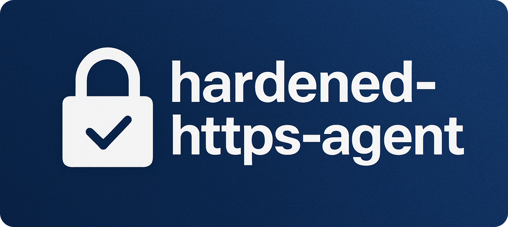

<p align="center">
  
</p>

# hardened-https-agent

A security-first `https.Agent` for Node.js with advanced certificate validation: Custom CA, Certificate Transparency (CT), OCSP, and CRLSet.

[](https://github.com/Gldywn/hardened-https-agent/actions/workflows/build.yml)
[](https://codecov.io/gh/Gldywn/hardened-https-agent)
[](https://www.npmjs.com/package/hardened-https-agent)
[](https://opensource.org/licenses/MIT)

## What is hardened-https-agent?

A quick search on GitHub reveals a recurring pattern: developers are surprised to learn that **Node.js does not validate TLS certificates the same way a browser does**. Issues have been raised in popular projects like [got](https://github.com/sindresorhus/got/issues/1994) and [Uptime Kuma](https://github.com/louislam/uptime-kuma/issues/1254) when users discover that connections to servers with _revoked certificates succeed without any warning_.

This behavior is, in fact, (more or less) intentional. As explained in the Node.js repository itself ([#16338](https://github.com/nodejs/node/issues/16338)), performing robust, browser-grade checks for things like certificate revocation is a complex task with performance and privacy trade-offs. Node.js provides the necessary cryptographic building blocks, but leaves the responsibility of implementing these advanced security policies entirely up to the developer.

This is where `hardened-https-agent` comes in. It provides modern, browser-grade security policies for your outbound TLS connections in two powerful ways:

1.  An **enhanced _https.Agent_ `HardenedHttpsAgent`** that acts as a secure, drop-in replacement for Node.js's default agent.
2.  A **standalone `HardenedHttpsValidationKit`** that exports the core validation logic, allowing you to secure other HTTPS agents (like [`proxy-agents`](https://github.com/TooTallNate/proxy-agents/)) or raw `tls.TLSSocket` directly.

It works with any library supporting the standard `https.Agent`, including [`axios`](https://axios-http.com/), [`got`](https://github.com/sindresorhus/got), [`node-fetch`](https://github.com/node-fetch/node-fetch), [`needle`](https://github.com/tomas/needle), and more.

### Default Node.js Behavior vs. `hardened-https-agent`

| Verification Check                                                                                       | Default Node.js (`https.Agent`) |   `hardened-https-agent`    |
| -------------------------------------------------------------------------------------------------------- | :-----------------------------: | :-------------------------: |
| **Trust Model**                                                                                          |                                 |                             |
| [Custom CA Store](https://en.wikipedia.org/wiki/Root_certificate)                                        |    ⚠️ (Optional `ca` prop.)     | ✅ (Enforced, with helpers) |
| **Certificate Revocation**                                                                               |                                 |                             |
| [OCSP Stapling](https://en.wikipedia.org/wiki/OCSP_stapling)                                             | ⚠️ (Raw staple, not validated)  |             ✅              |
| [OCSP Direct](https://fr.wikipedia.org/wiki/Online_Certificate_Status_Protocol)                          |               ❌                |             ✅              |
| [CRLs](https://en.wikipedia.org/wiki/Certificate_revocation_list)                                        |    ⚠️ (Manual CRL file only)    |        ⏳ (Planned)         |
| [CRLSet](https://www.chromium.org/Home/chromium-security/crlsets/)                                       |               ❌                |             ✅              |
| [CRLite](https://blog.mozilla.org/security/2020/01/09/crlite-part-1-all-web-pki-revocations-compressed/) |               ❌                |        ⏳ (Planned)         |
| **Certificate Integrity**                                                                                |                                 |                             |
| [Certificate Transparency (CT)](https://certificate.transparency.dev/)                                   |               ❌                |             ✅              |

See **[BACKGROUND.md: Why a Hardened Agent?](./BACKGROUND.md)** for a detailed technical explanation of the gaps in Node.js's default behavior.

## Use Cases

This library is designed for any Node.js application that needs to **reliably verify the authenticity of a remote server**. Its primary goal is to protect against connecting to servers using _revoked or mis-issued certificates_, a check that Node.js does not perform by default.

It's essential for:

- **Hardening standard HTTP clients**: A simple, drop-in replacement agent for libraries like `axios` or `got`.
- **Securing complex connection scenarios**: Adding robust TLS validation to existing agents that you can't easily replace, such as `https-proxy-agent`.
- **Low-level TLS validation**: Applying advanced checks (CT, OCSP, etc.) directly on `tls.TLSSocket` instances.
- **General security**: Protecting backend services, client SDKs, or applications in trust-minimized environments like TEEs or AI agents.

The library ships with a **set of pre-defined policies** for common needs, while **also providing complete control to create a tailored policy** that fits your exact security requirements.

## Features

### Implemented

- [x] **Certificate Transparency (CT)** (via Embedded SCTs)
- [x] **OCSP "Stapling"** (Checks the OCSP response provided by the server during the TLS handshake)
- [x] **OCSP "Direct"** (Client sends an OCSP request directly to the CA)
- [x] **OCSP "Mixed"** (Use OCSP Stapling with a fallback to a direct OCSP request if the staple is not provided or fails.)
- [x] **CRLSet** (Fast and efficient revocation checks using Google Chrome's aggregated CRL lists)

### Roadmap

- [ ] **Classic CRLs**: Support for checking CRLs from Distribution Points extracted from the certificate.
- [ ] **Enforce CT Pre-Publication**: Add an option to require that certificates have been publicly logged in CT for a minimum duration before being trusted, making mis-issuance nearly impossible.
- [ ] **CRLite**: Support for lightweight, aggregated CRLs (an alternative to Chrome's CRLSet, developed by Mozilla).

## Installation

```sh
npm install hardened-https-agent
```

## Usage

This library can be used in two primary ways: as a simple, all-in-one agent, or as a standalone validation kit for advanced use cases.

### Method 1: All-in-One `HardenedHttpsAgent` (Simple)

This is the easiest way to get started. The `HardenedHttpsAgent` is a drop-in replacement for the default `https.Agent` and handles all validation internally.

By simply using this setup, you immediately benefit from all the built-in security layers: CA validation using the Cloudflare bundle, certificate revocation checks via OCSP (stapling and direct), CRLSet-based revocation with signature verification (using the latest Google CRLSet), and enforcement that the presented certificate is properly published in Certificate Transparency logs. All of this is enabled out of the box, no extra configuration required.

```typescript
import { HardenedHttpsAgent, defaultAgentOptions } from 'hardened-https-agent';

// Customize standard agent options if required
const httpsAgentOptions: https.AgentOptions = {
  keepAlive: true,
  timeout: 55000,
  maxSockets: 20,
  maxFreeSockets: 5,
  maxCachedSessions: 500,
};

// Merge standard agent options with hardened defaults
const agent = new HardenedHttpsAgent({
  ...httpsAgentOptions,
  ...defaultAgentOptions(),
});

const client = axios.create({ httpsAgent: agent, timeout: 15000 });
const response = await client.get('https://example.com');
// You've got your first hardened `response`
```

**Real-world examples (for `axios`, `got`, `node:https`, custom policies, and more) are available in the [examples](./examples/) directory.**  
If your preferred HTTP client is missing, feel free to open an issue to request an example or confirm compatibility.

### Method 2: `HardenedHttpsValidationKit` (Advanced)

For more complex scenarios, the core validation logic is exported as the `HardenedHttpsValidationKit`. This is useful when you can't simply replace the `https.Agent`, since Node.js does not provide a straightforward way to "compose" or "wrap" agents.

Using the validation kit is a two-step process:
1.  **Prepare Connection Options**: You must first pass your connection options through `kit.applyBeforeConnect(options)`. This function returns a modified options object, allowing the kit's validators to inject any necessary parameters (e.g., forcing `requestOCSP: true` for OCSP stapling) before a connection is attempted.
2.  **Attach the Kit**: Next, you must attach the kit to either an `http.Agent` instance or a raw `tls.TLSSocket`.
    - **`kit.attachToAgent(agent)` (High-Level)**: This is the easiest method. It hooks into the agent's `keylog` event to automatically validate the underlying socket.
    - **`kit.attachToSocket(socket)` (Low-Level)**: This gives you fine-grained control, attaching the validation logic directly to a socket you manage.

#### High-Level: Enhancing an Existing Agent

Here is an example of how to enhance `https-proxy-agent`:

```typescript
import { HttpsProxyAgent, HttpsProxyAgentOptions } from 'https-proxy-agent';
import { HardenedHttpsValidationKit, defaultAgentOptions } from 'hardened-https-agent';

// Create a validation kit with hardened defaults
const kit = new HardenedHttpsValidationKit({
  ...defaultAgentOptions(),
  enableLogging: true,
});

// Define your HTTPS proxy agent options as usual
const httpsProxyAgentOpts: HttpsProxyAgentOptions<'https'> = {
  keepAlive: true,
};

// Create the proxy agent, applying validation kit to options before passing them
const agent = new HttpsProxyAgent('http://127.0.0.1:3128', kit.applyBeforeConnect(httpsProxyAgentOpts));

// Attach the validation kit to the agent
kit.attachToAgent(agent as http.Agent);

const req = https.request(
  'https://example.com',
  { method: 'GET', agent: agent as http.Agent, timeout: 15000 },
  (response) => {
    // You've got your first hardened `response`
  },
);
```

**A complete example is available at [examples/validation-kit.ts](./examples/validation-kit.ts).**

#### Low-Level: Securing a Raw `tls.TLSSocket`

For maximum control, you can apply validation directly to a `tls.TLSSocket`. This is the same method the `HardenedHttpsAgent` uses internally. You can view its source code in [`src/agent.ts`](./src/agent.ts) for a real-world implementation.

The process involves calling `tls.connect` with the modified options and then immediately attaching the kit to the newly created socket.

```typescript
// Assume `kit` is an initialized HardenedHttpsValidationKit
// and `options` are your initial tls.connect options.

// Allow validators to modify the connection options
const finalOptions = kit.applyBeforeConnect(options);

// Create the socket
const socket = tls.connect(finalOptions);

// Attach the validation kit to the socket
// The socket will be passed back to the callback from the validation kit
this.#kit.attachToSocket(socket, callback);
```

### `HardenedHttpsAgent` & `HardenedHttpsValidationKit` Options

The options below are used to configure the security policies of the `HardenedHttpsAgent`. When using the `HardenedHttpsValidationKit`, only a subset of these options are available (`ctPolicy`, `ocspPolicy`, `crlSetPolicy`, and `enableLogging`).

| **Property**        | **Type**                                      | **Required / Variants**                                                                                                                                                                | **Helper(s)**                                          |
| ------------------- | --------------------------------------------- | -------------------------------------------------------------------------------------------------------------------------------------------------------------------------------------- | ------------------------------------------------------ |
| `ca`                | `string \| Buffer \| Array<string \| Buffer>` | Required. Custom trust store that replaces Node.js defaults. Accepts PEM string, `Buffer`, or an array of either.                                                                      | `embeddedCfsslCaBundle`, `useNodeDefaultCaBundle()`    |
| `ctPolicy`          | `CertificateTransparencyPolicy`               | Optional. Enables CT when present. Fields: `logList: UnifiedCTLogList`, `minEmbeddedScts?: number`, `minDistinctOperators?: number`.                                                   | `basicCtPolicy()`, `embeddedUnifiedCtLogList`          |
| `ocspPolicy`        | `OCSPPolicy`                                  | Optional. Enables OCSP when present. Fields: `mode: 'mixed' \| 'stapling' \| 'direct'`, `failHard: boolean`.                                                                           | `basicStaplingOcspPolicy()`, `basicDirectOcspPolicy()` |
| `crlSetPolicy`      | `CRLSetPolicy`                                | Optional. Enables CRLSet when present. Fields: `crlSet?: CRLSet`, `verifySignature?: boolean`, `updateStrategy?: 'always' \| 'on-expiry'`.                                             | `basicCrlSetPolicy()`                                  |
| `enableLogging`     | `boolean`                                     | Optional (default: `false`).                                                                                                                                                           |                                                        |
| Standard HTTPS opts | `https.AgentOptions`                          | Optional. Any standard Node.js `https.Agent` options (e.g., `keepAlive`, `maxSockets`, `timeout`, `maxFreeSockets`, `maxCachedSessions`) can be merged alongside the hardened options. |                                                        |

_All options are thoroughly documented directly in the library via JSDoc comments for easy in-editor reference and autocomplete._

Import convenience presets and building blocks as needed, to help you construct your custom HardenedHttpsAgent:

```typescript
import {
  defaultAgentOptions,
  useNodeDefaultCaBundle,
  embeddedCfsslCaBundle,
  embeddedUnifiedCtLogList,
  basicCtPolicy,
  basicMixedOcspPolicy,
  basicStaplingOcspPolicy,
  basicDirectOcspPolicy,
  basicCrlSetPolicy,
} from 'hardened-https-agent';
```

### Embedded resources ⚠️

The default helpers such as `embeddedCfsslCaBundle` and `embeddedUnifiedCtLogList` use embedded resources committed in this repository (CA bundle from Cloudflare CFSSL; unified CT log list merged from Google and Apple sources).

- These embedded resources are refreshed via an automated weekly GitHub Action that fetches the latest upstream data and opens a pull request to update the repository. Updates are executed on GitHub’s infrastructure and are fully auditable in pull request diffs and timestamps.
- If you choose to rely on embedded resources, you are responsible for updating the library in your project to receive the refreshed data at your desired cadence.
- Alternatively, you can opt into Node's default CA bundle with `useNodeDefaultCaBundle()` if that trust model better suits your environment.
- You can also choose not to rely on embedded resources at all: provide your own CA bundle, your own unified CT log list, and configure every other property yourself. Everything is fully customizable.

### `HardenedHttpsAgent` customization (quick recipes)

Bring your own CA bundle:

```typescript
new HardenedHttpsAgent({ ...defaultAgentOptions(), ca: myPemStringOrBuffer });
```

Use Node default CA bundle:

```typescript
new HardenedHttpsAgent({ ...defaultAgentOptions(), ca: useNodeDefaultCaBundle() });
```

Tune standard `https.Agent` behavior:

```typescript
new HardenedHttpsAgent({
  ...defaultAgentOptions(),
  keepAlive: true,
  maxSockets: 50,
});
```

Use a custom CT policy:

```typescript
new HardenedHttpsAgent({
  ...defaultAgentOptions(),
  ctPolicy: {
    logList: embeddedUnifiedCtLogList,
    minEmbeddedScts: 3,
    minDistinctOperators: 3,
  },
});
```

Use a custom OCSP policy:

```typescript
new HardenedHttpsAgent({
  ...defaultAgentOptions(),
  ocspPolicy: {
    mode: 'stapling',
    failHard: true,
  },
});
```

Use a custom CRLSet policy:

```typescript
new HardenedHttpsAgent({
  ...defaultAgentOptions(),
  crlSetPolicy: {
    verifySignature: true,
    updateStrategy: 'always',
  },
});
```

Enable detailed logs:

```typescript
new HardenedHttpsAgent({ ...defaultAgentOptions(), enableLogging: true });
```

## Contributing

We welcome contributions of all kinds! A great place to start is by checking out the [Roadmap](#roadmap) for planned features or looking at the open [issues](https://github.com/Gldywn/hardened-https-agent/issues) for bugs and feature requests.

Before you get started, please take a moment to review our **[CONTRIBUTING.md](./CONTRIBUTING.md)** guide, which contains all the information you need to set up your environment and submit your changes.

## Related Works

- [**@gldywn/sct.js**](https://github.com/Gldywn/sct.js): SCT.js is a low-level TypeScript library for Node.js that parses and verifies Signed Certificate Timestamps (SCTs).
- [**@gldywn/crlset.js**](https://github.com/Gldywn/crlset.js): CRLSet.js is a lightweight CRLSet parser and verifier in TypeScript for Node.js. It fetches and parses the latest Chrome CRLSet in memory, with support for checking whether a certificate or its issuer has been revoked.
- [**@timokoessler/easy-ocsp**](https://github.com/timokoessler/easy-ocsp): An easy-to-use OCSP client for Node.js.

## License

`hardened-https-agent` is distributed under the MIT license.
